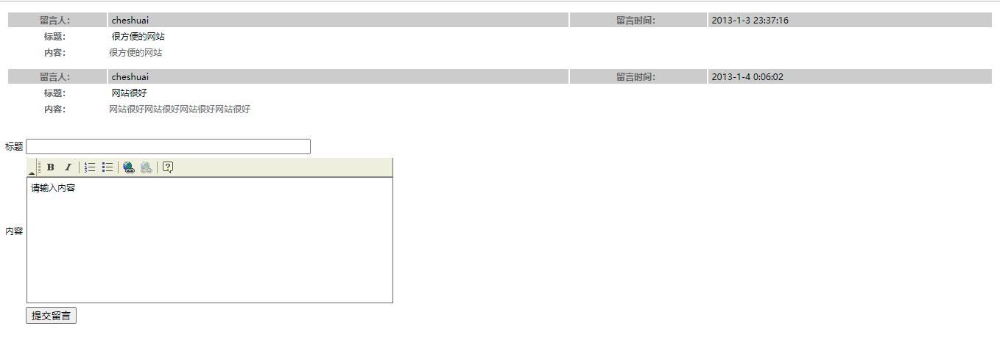
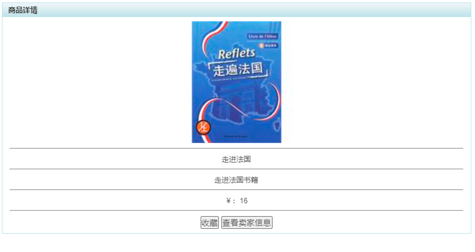
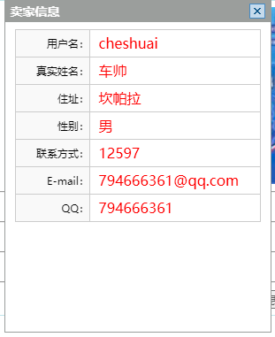
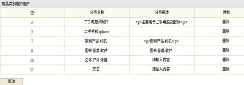
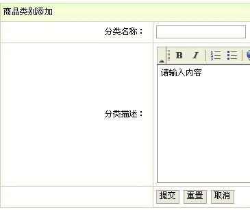

### 框架与技术

#### JSP

​	java server page 是sun公司制订的一种服务器端动态页面生成技术的规范。SUN公司在Java的基础下开发出的JSP具有动态页面与静态页面分离，能够脱离硬件平台的束缚，以及编译后到处运行等优点而大大提高了其执行效率，逐渐成为因特网上的主流开发工具。

#### JDBC

​	JDBC( Java DataBase Connectivity,java数据库连接 )是一种用于执行SQL语句的Java API , 可以为多种关系数据库提供统一访问 , 它由一组用Java语言编写的类和接口组成。

#### Struts2

​	最早出现的Struts1是一个非常著名的框架，它实现了MVC模式。Struts1简单小巧，其中最成熟的版本是Struts1.2。 以后出现了WebWork框架，其实现技术比Struts1先进，但影响力不如Struts1。 在框架技术丌断发展过程中，有人在WebWork核心XWork的基础上包装了Struts1（算是两种框架的整合），由此，结合了Struts1的影响力和WebWork的先进技术，Struts2诞生了。

#### Hibernate

​	Hibernate是开源的、用于封装数据访问层的组件，我们称为数据访问层框架（戒持久层框架）。

#### Spring

​	Spring用于整合，好处是解耦。解耦，可以降低组件不组件间的关联，改善程序结构，便于系统的维护和扩展。我们在使用Spring框架时，主要是使用Spring容器的两个特性：IoC和AoP。 IoC全称Inverse of Control（反向控制戒控制反转）。

#### MySQL

​	MySQL是最受欢迎的开源SQL数据库管理系统，它由MySQL AB开发、发布和支持。MySQL是一个快速的、多线程、多用户和健壮的SQL数据库服务器。MySQL作为后台数据库工具，它功能远比Fox、Access强大，并提供了许多标准的关系数据库管理功能的支持。它各种关系数据库管理系统适应于各种硬件平台，包括Unix，PC和主机系统。

#### TOMCAT

​	Tomcat是一个开放源代码、运行Serv1et和JSPWeb应用软件的基于Java的Web应用软件容器。Tomcat是由Apache一Jakarta子项目支持，并由来自开放代码Java社区的志愿者进行维护。TomcatServer是根据servlet和JSP规律执行的，因此我们就可以说Tomcatserver也实行了Apache一Jakarta规比绝大多数商业应用软件服务器要好。

 #### JAVA

​	Java是一种简单易用、完全面向对象、具有平台无关性且安全可靠的主要面向Internet的开发工具。自从1995年正式问世以来，Java的快速发展已经让整个Web世界发生了翻天覆地的变化。

### 界面分析

#### 主界面

##### 首页导航栏

- 实现各个操作页面（首页、留言板、我的信息等）的切换
- 实现对网站主要功能的确定
- 实现网站的美观性

##### 查询

- 此系统目前只实现了按商品名称查询，输入商品名称就可以查找自己想寻找的商品。主要是是通过在数据库中查询相，模糊匹配的商品名。

  ~~~ java
  //搜索
  public String goodSearch()
  	{
          Map request=(Map)ServletActionContext.getContext().get("request");
  		String sql="";
  		sql="from TGoods where goodsDel='no' and goodsName like '%"+goodsName.trim()+"%'"+" order by goodsCatelogId";
  //查询的sql语句，
  		List goodsList=goodsDAO.getHibernateTemplate().find(sql);
  //在数据库中查询
  		request.put("goodsList", goodsList);
  //将查询结果放入request对象中
  		return ActionSupport.SUCCESS;
  	}
  
  ~~~

  

##### 用户登录

- 其主要是通过查询数据库，查看输入的用户名是否存在，用户密码是否正确

  ~~~ java
  //用户登录
  public String userLogin()
  	{
  String sql="from TUser where userName=? and userPw=?";
  //sql语句
  Object[] con={userName,userPw};
  //参数
  List userList=userDAO.getHibernateTemplate().find(sql,con);
  //从数据库中查询用户
  	if(userList.size()==0)//如果用户不存在
  		{
  			this.setMessage("用户名或密码错误");
  			this.setPath("qiantai/default.jsp");
  		}
  		else{
  //如果用户存在，把用户信息放入session中
  	 Map session=ServletActionContext.getContext().getSession();
  			 TUser user=(TUser)userList.get(0);
  			 session.put("user", user);
  //把用户信息放入session
  			 this.setMessage("成功登录");
  			 this.setPath("qiantai/default.jsp");
  		}
  		return "succeed";
  	}
  
  ~~~

##### 网站公告

- 通过公告给新用户提示本站的主要功能以及必须注意的要点

##### 日历

- 网站的美化是整个网站的成败的重要因素，虽然日历在整个网站功能上没有什么具体作用，但它可以美化整个网站

  ~~~ jsp
  <!--①得到当前的系统的日期-->
  GregorianCalendar currentDay = new GregorianCalendar();
      int year= currentDay.get(Calendar.YEAR);
      int month=currentDay.get(Calendar.MONTH);
      int today=currentDay.get(Calendar.DAY_OF_MONTH);
  int weekday=currentDay.get(Calendar.DAY_OF_WEEK);
  
  <!--②日历样式的实现-->
  <!—采有for双层循环得到日历样式-->
    <% for(int j=0;j<6;j++) { %>
        <tr style="font-size: 12px;">
          <% 
             for(int i=j*7;i<(j+1)*7;i++) { 
  <!—如是为当前日期就将其颜色改为灰色-->
        if((i-firstIndex+1)==today){%>    
           <td width="30" height="23" align="center" bgcolor="gray" style="border:1 solid">
  <b><%=days[i]%></b></td>
                  <% }else{ %>
                        <td width="30" height="23" align="center" style="border:1 solid"><%=days[i]%></td>
                  <%    }
                    }%>
              </tr>
              <% } %>
  
  ~~~

#### 留言板

#### 商品详情

- 查看商品详情功能主要是通过商品的ID进行查询，这样能保证从数据库里查出来的商品唯一性

  ~~~ java
  public TGoods findById(int id)//通过商品ID进行查询
  	{
  		log.debug("getting TGoods instance with id: " + id);
  		try
  		{
  //通过ID去查找TGoods，找到则返回，否则抛出异常
  			TGoods instance = (TGoods) getHibernateTemplate().get(
  					"com.model.TGoods", id);
  			return instance;
  		} catch (RuntimeException re)
  		{
  			log.error("get failed", re);
  			throw re;
  		}
  	}
  
  ~~~

  

#### 查看卖家信息

- 每次卖家发布出售商品，都会通过数据库中的外键将卖家的ID存入到商品表中，我们只需要能过卖家的ID 就能找到对就的卖家信息

  ~~~ java
  public TUser findById(java.lang.Integer id) //通过用户ID进行查询卖家信息
  	{
  		log.debug("getting TUser instance with id: " + id);
  		try
  		{
  //通过ID去查找TUser，找到则返回，否则抛出异常
  			TUser instance = (TUser) getHibernateTemplate().get(
  					"com.model.TUser", id);
  			return instance;
  		} catch (RuntimeException re)
  		{
  			log.error("get failed", re);
  			throw re;
  		}
  	}
  
  ~~~

#### 管理用户

- 可以查看注册的用户作息，对注册用户进行删出操作，但是并没有在数据库中删出用户，原因是也许删出的用户有发布的商品，这样将影响网站一些功能，只是将注册用户的是否被删出属性（user_del）改为YES

  ~~~ java
  //①查询所有注册用户实现的代码如下：
  public List findAll()
  	    {
  			log.debug("finding all TUser instances");
  			try
  			{
  			String queryString = "from TUser where userDel='no'";
  //查询没有被管理员删出的用户
  			return getHibernateTemplate().find(queryString);
  				} catch (RuntimeException re)
  			{
  			log.error("find all failed", re);
  			throw re;
  			}
  		}
  //②删出注册用户主要代码实现：
  public void delete(TUser persistentInstance)
  			{
  				log.debug("deleting TUser instance");
  				try
  				{
  					getHibernateTemplate().delete(persistentInstance);
  					log.debug("delete successful");
  				} catch (RuntimeException re)
  				{
  					log.error("delete failed", re);
  					throw re;
  				}
  			}
  
  ~~~

#### 管理商品

- 商品类别管理，主要功能是添加和删出商品类别，在删出商品类别时不会将数据库中的原商品类别删出，只会将商品类别是否被删出属性修改为YES

  ~~~ java
  //①查看所有商品类别的实现代码：
  public List findAll()
  			{
  				log.debug("finding all TCatelog instances");
  				try
  				{
  					String queryString = "from TCatelog";
  					return getHibernateTemplate().find(queryString);
  //从数据库中查找所有的商品类别，并返回。
  		} catch (RuntimeException re)
  			{
  			log.error("find all failed", re);
  			throw re;
  		   }
  	}
  //②商品类别添加实现代码：
  public void save(TCatelog transientInstance)
  			{
  				log.debug("saving TCatelog instance");
  				try
  				{
  //向数据库中保存新增的商品类别
  					getHibernateTemplate().save(transientInstance);
  					log.debug("save successful");
  				} catch (RuntimeException re)
  				{
  					log.error("save failed", re);
  					throw re;
  				}
  			}
  //③商品类别删出代码：
  public void delete(TCatelog persistentInstance)
  		{
  			log.debug("deleting TCatelog instance");
  			try
  			{
  					getHibernateTemplate().delete(persistentInstance);
  //从数据库中的删出商品类别
  					log.debug("delete successful");
  				} catch (RuntimeException re)
  				{
  					log.error("delete failed", re);
  					throw re;
  				}
  			}
  
  ~~~

  